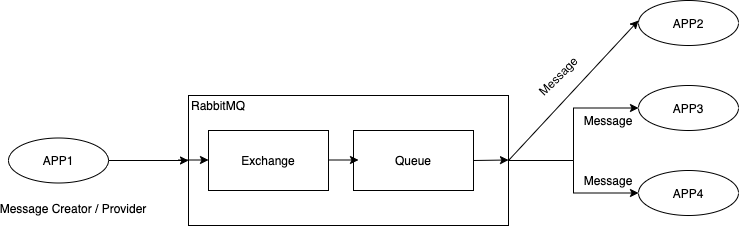
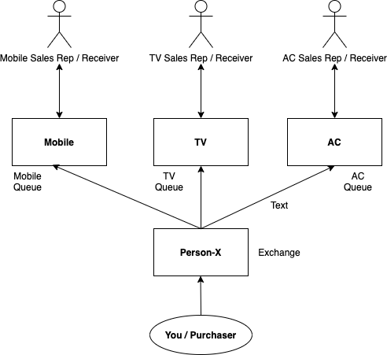
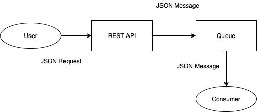
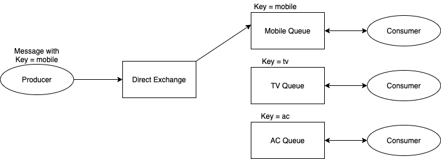
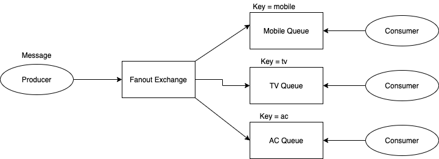
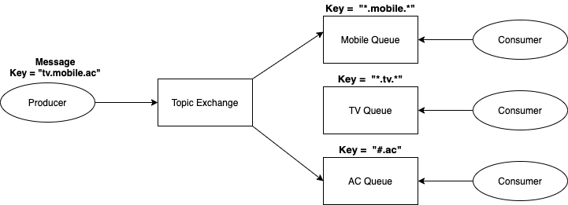
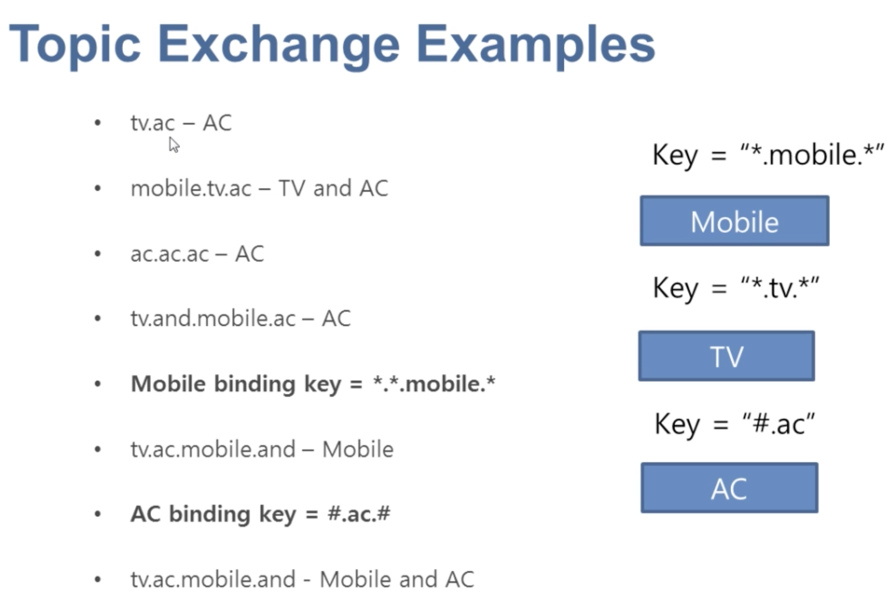

# Learn Rabbit MQ

## Understanding of JMS and RabbitMQ

### JMS
Java Messaging System (JMS)

Here is the typical example of JMS architecture overview. 

Here is the type JMS example:

### Real Time Example

### Type of JMS Exchanges
There are FOUR different types of exchanges available in JMS
 - Direct
 - Fanout
 - Headers
 - Topic
 
##Direct Exchange
### What is Direct Exchange
- This type of messages will first goto the Exchanges.
- Through Exchange, message will pass to Queue using binding key
- From Queue to consumer
- In order to bind a Queue in Exchange we have to provide a "Key"

Steps to follow to create Direct Exchange and Queue:
- First: Create a Exchange with type as Direct (ex: direct-exchange)
- Second: Create three different Queues namely "Mobile", "TV" and "AC"
- Third: Attach the created Queue in Exchange under `Bindings` using `Add binding from this exchange` with `Queue Name` and `Routing Key`.

>TIP: By using this `Direct Exchange` `Message Producer` will talk to `Exchange` whereas `Message Consumer` will talk to `Queue` to get the message.

> For Source code refer `com.techstack.queue.direct` package

##Fanout Exchange
### What is Fanout Exchange
- This type of messages will first goto the Exchanges.
- Through Exchange, message will pass to **EACH** Queue which is associated with this Exchange
- From Queue to consumer
- In order to bind a Queue in Exchange we have to provide a "Key"

Typical example for Fanout Exchange is Publish-Subscribe model like Group Message or Bulk Email or other form of Group Messages.  

Steps to follow to create Fanout Exchange and Queue:
- First: Create a FanoutExchange with type as Fanout (ex: fanout-exchange)
- Second: Create two different Queues namely "Mobile" and "AC"
- Third: Attach the created Queue in FanoutExchange under `Bindings` using `Add binding from this exchange` with `Queue Name`.

>TIP: By using this `Fanout Exchange` `Message Producer` will talk to `Exchange` whereas `Message Consumer` will talk to `Queue` to get the message.

> For Source code refer `com.techstack.queue.fanout` package

##Topic Exchange
### What is Topic Exchange
- This type of messages will first goto the Topic Exchanges.
- 

Steps to follow to create Topic Exchange and Queue:
- First: Create a FanoutExchange with type as Fanout (ex: fanout-exchange)
- Second: Create two different Queues namely "Mobile" and "AC"
- Third: Attach the created Queue in FanoutExchange under `Bindings` using `Add binding from this exchange` with `Queue Name`.

Key points:
- Producer side, message created with `key` separated by `.`(dot). For example: `tv.mobile.ac`
- Topic Exchange would identify those keys `*.mobile.*`. Which means `*` means `eactly one word` before and after the mobile.
- `#.ac` here `#` means `any number of words` before `ac`
- Here in the above diagram, TV expresion `*.tv.*` doesn't satisfy the TOPIC Exchange key format. Hence, message will not 
moved to it's Queue. Expected is `tv.*.*`

Some Examples about Topic Key:

>TIP: By using this `Topic Exchange` `Message Producer` will talk to `Exchange` whereas `Message Consumer` will talk to `Queue` to get the message.

> For Source code refer `com.techstack.queue.topic` package

